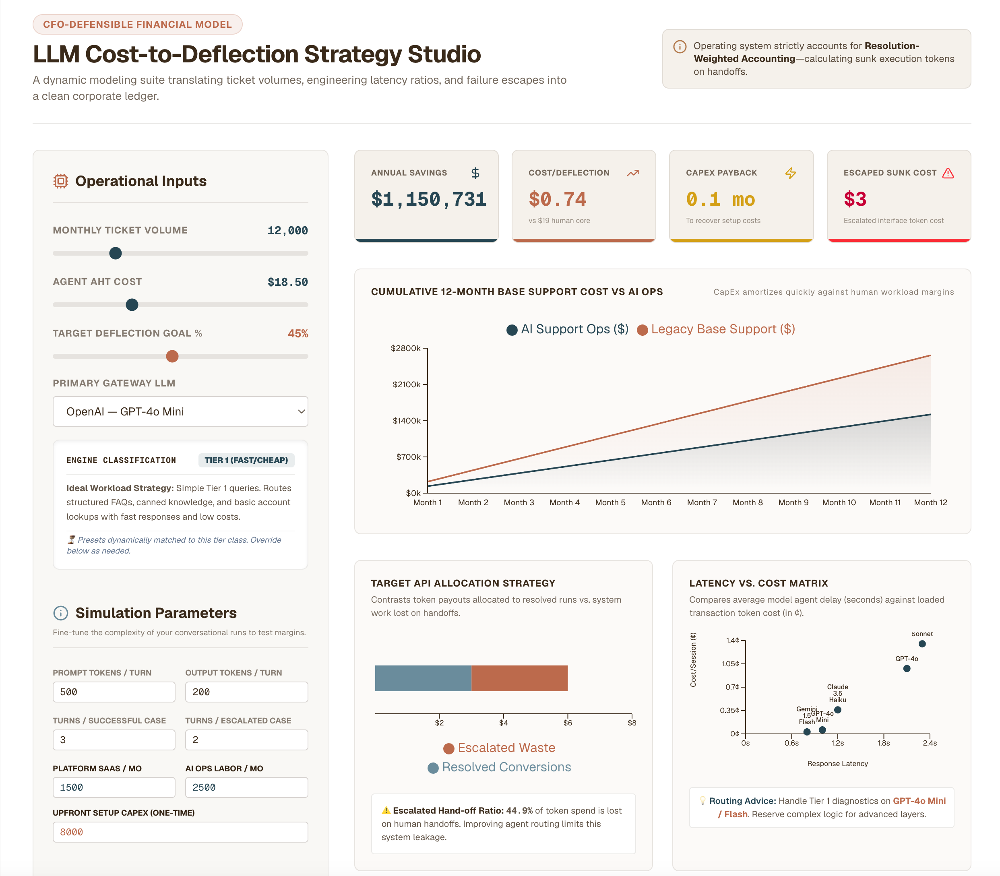

# Wes on Ops

> Frameworks and working tools for building modern support organizations.

🔗 **Live tools:** [wesonops.com](https://wesonops.com)

Opinionated, AI-first, and built from the field. Authored by a 
Director of Support who got tired of rebuilding the same models and 
decks at every company.

---

## Tools

### 🧮 LLM ROI Modeler — *Live*
**A CFO-grade strategy model for AI agent budgets.** Calculates 
support-op token economics, engine latency matrices, and escape 
hand-off taxes to build defensible deflection investment cases.

Vendor pitches give you deflection rate. Finance asks for cost per 
deflected ticket. Engineering asks which model. This modeler 
unifies all three views into a single decision artifact.

**What it models:**
- Token economics across frontier and open-source models
- Latency-vs-cost tradeoff matrices
- **Escape hand-off tax** — the hidden cost of failed deflections 
  that escalate angrier than they started
- Break-even deflection rate vs. fully-loaded agent cost
- Sensitivity analysis on volume and deflection-rate shifts

🔗 **Try it:** [https://www.wesonops.com/tools/llm-cost-calculator](https://www.wesonops.com/tools/llm-cost-calculator) 

---

### 🔍 SLA RCA Auditor — *Demo coming soon*
**An agentic workflow that translates raw tickets into audit-ready 
RCA documents.** Enforces data integrity and SOC2 compliance via a 
gatekeeping architecture.

Built for support orgs operating under SOC2 CC7 controls where every 
SLA breach triggers the same painful loop: pull ticket data, 
reconstruct timeline, draft RCA in audit-acceptable format, route 
for review. The Auditor automates the first three steps and routes 
a defensible draft to a human gate.

**Key design choice:** agentic, not single-shot LLM. RCAs need 
evidence chains. A gatekeeping architecture leaves an audit trail — 
which is the whole point in a SOC2 context.

📹 **Walkthrough demo + early access:** [wesonops.com/auditor](https://wesonops.com/auditor) 

---

## Related Work

- **[cxdebt.com](https://cxdebt.com)** — flagship calculator for 
  quantifying CX debt. ([repo](https://github.com/wesleyshiCX/cxdebt))

---

## Status

- **LLM ROI Modeler:** Live at [wesonops.com](https://wesonops.com)
- **SLA RCA Auditor:** Architecture complete; demo + waitlist live; 
  full release pending usage cost model

## Author

Built by **[Wes Shi](https://github.com/wesleyshiCX)** — support 
leadership, Purposeful AIOPs. Currently exploring Director / Head of 
Support roles in SaaS, AI, and developer tooling.
