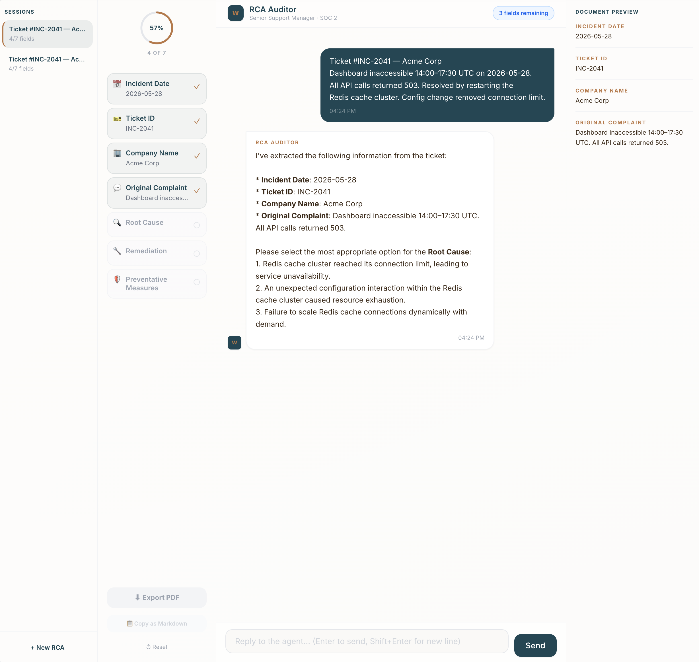

# Wes on Ops

> Frameworks and working tools for building modern support organizations.

🔗 **Live tools:** [wesonops.com](https://wesonops.com)

Opinionated, AI-first, and built from the field. Authored by a 
Director of Support who got tired of rebuilding the same models and 
decks at every company.

---

## Tools

### 🧮 AI Deflection TCO Studio — *Live*
**A CFO-grade Total Economic Impact model for AI support deflection.** 
Built on a pure, unit-tested computation engine with the honest math 
vendor calculators leave out.

Vendor pitches give you a deflection rate and a four-digit ROI. 
Finance asks for cost per deflected ticket with a real denominator. 
Engineering asks which model and what it costs at turn four, not 
turn one. This studio unifies all three views into a single 
decision artifact.

**Why the numbers hold up in a finance review:**
- **Honest first-year ROI** — benefit divided by *CapEx plus 12 
  months of operating cost*, not CapEx alone. No 19,000% fantasy 
  figures.
- **History-aware token model** — each turn's prompt carries the 
  full conversation history plus system/RAG context, so session 
  costs grow realistically (2–4× what flat-per-turn models show), 
  with an overhead multiplier for retries, guardrails, and eval 
  traffic.
- **The costs vendors omit** — maintenance FTE for prompt/KB/eval 
  upkeep, volume-scaled compliance and observability infra, and the 
  **sunk escalation tax**: tokens burned on conversations that 
  escalate to a human anyway.
- **Labor capture rate** — staffing isn't perfectly elastic; the 
  model discounts avoided handle-time to what you can actually bank.
- **Extended TEI, fenced off** — churn revenue protected and FTE 
  capacity reclaimed are reported as directional strategic value, 
  *never* blended into the headline ROI. No double-counting labor.

**What you get out of it:**
- Conservative / Base / Optimistic scenario comparison, side by side
- 12-month cumulative TCO vs. legacy baseline with break-even marker
- Monthly cost composition (spoiler: it's rarely the tokens)
- Built-in input validation that flags unrealistic assumptions 
  before they reach a board deck
- A copy-ready executive brief for decks, email, or Slack
- **Board Mode** — hides all inputs for clean executive screen-share

🔗 **Try it:** [https://www.wesonops.com/llm-cost](https://www.wesonops.com/llm-cost) 

---

### 🔍 SLA RCA Auditor — *Demo coming soon*
**An agentic workflow that translates raw tickets into audit-ready 
RCA documents.** Enforces data integrity and SOC2 compliance via a 
gatekeeping architecture.

Built for support orgs operating under SOC2 CC7 controls where every 
SLA breach triggers the same painful loop: pull ticket data, 
reconstruct timeline, draft RCA in audit-acceptable format, route 
for review. The Auditor automates the first three steps and routes 
a defensible draft to a human gate.

**Key design choice:** agentic, not single-shot LLM. RCAs need 
evidence chains. A gatekeeping architecture leaves an audit trail — 
which is the whole point in a SOC2 context.

📹 **Walkthrough demo + early access:** [wesonops.com/auditor](https://wesonops.com/auditor) 

---

## Related Work

- **[cxdebt.com](https://cxdebt.com)** — flagship calculator for 
  quantifying CX debt. ([repo](https://github.com/wesleyshiCX/cxdebt))

---

## Status

- **AI Deflection TCO Studio:** Live at [wesonops.com](https://wesonops.com)
- **SLA RCA Auditor:** Architecture complete; demo + waitlist live; 
  full release pending usage cost model

## Author

Built by **[Wes Shi](https://github.com/wesleyshiCX)** — support 
leadership, Purposeful AIOPs. Currently exploring Director / Head of 
Support roles in SaaS, AI, and developer tooling.
